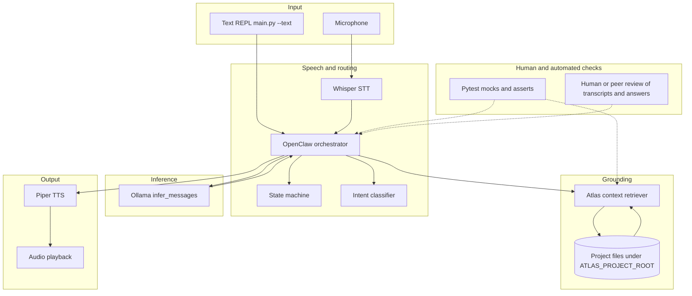

# Atlas — Voice Developer Assistant

Local-first voice assistant for developers: **Whisper (STT)** → **OpenClaw (orchestration)** → **`atlas_context` (retrieval)** → **Ollama (LLM)** → **Piper (TTS)**. Control phrases override other logic so sleep, wake, and shutdown stay predictable.

---

## Title and summary

**Atlas** is a **hands-free coding assistant** that listens (or accepts typed input), loads the right files from your project, asks a local **Ollama** model for concise spoken answers, and reads them back with **Piper**. It matters for **privacy and control**: models and audio can stay on your machine, and retrieval is **scoped to a project root** with basic path safety.

---

## Architecture overview

High-level components and data flow:

| Role | Component | Responsibility |
|------|-----------|----------------|
| **Input** | Microphone + `main.py`, optional `--text` REPL | Raw audio or typed text |
| **STT** | `audio/` + `WhisperSTT` | Speech → transcript |
| **Orchestrator / agent** | `openclaw/` (`OpenClawOrchestrator`) | Control phrases, intents, prompt assembly, speech plan |
| **State** | `state_machine.py` | `IDLE` / `ACTIVE` / `SLEEP` / `SHUTDOWN` |
| **Intent routing** | `openclaw/intents.py` | Maps utterances to task types (e.g. explain, summarize) |
| **Retriever** | `atlas_context/` | Resolves which file/snippet to inject into the prompt |
| **LLM** | `llm/ollama_client.py` | Single chat completion; no tools, no filesystem |
| **Output** | `tts/` + `output/player.py` | Synthesize WAV and play cues + answer chunks |

**Flow (input → process → output):**  
**Audio or text** → **transcript** → **OpenClaw** (wake/sleep/shutdown or developer intent) → **context bundle** from disk → **messages to Ollama** → **assistant text** → **chunked `speech_sequence`** → **TTS + playback**.

**Where humans and testing check AI results:**

| Checkpoint | What happens |
|------------|----------------|
| **Developer** | Uses `--text` mode or listens to spoken output; verifies answers against real files. |
| **Automated tests** | `pytest` mocks the LLM and asserts orchestration, state, context resolution, and TTS path logic (**20 tests**). |
| **Errors** | Orchestrator catches inference failures and turns them into a spoken error string; `main.py` logs TTS failures to stderr. |

### System diagram



---

## Setup instructions

### 1. Environment

```bash
cd voice-dev-assistant
python3 -m venv .venv
source .venv/bin/activate   # Windows: .venv\Scripts\activate
pip install -r requirements.txt
```

### 2. Ollama (local LLM)

Install [Ollama](https://ollama.com/) and pull the default model (**`llama3.1:8b`** — override with `export ATLAS_OLLAMA_MODEL=…`):

```bash
ollama pull llama3.1:8b
```

API base defaults to `http://127.0.0.1:11434` (`OLLAMA_HOST` to override).

### 3. Whisper (speech-to-text)

The app prefers **faster-whisper**. Default model is **base** via `ATLAS_WHISPER_MODEL`.

```bash
export ATLAS_WHISPER_MODEL=small
export ATLAS_WHISPER_DEVICE=cpu
export ATLAS_WHISPER_COMPUTE=int8      # float32 if int8 unsupported
```

Fallback: **openai-whisper** if faster-whisper is unavailable.

### 4. Piper TTS

1. `pip install -r requirements.txt` includes **`piper-tts`**.
2. Download a voice **`.onnx`** (+ matching `.json`).
3. Point Atlas at it:

```bash
export ATLAS_PIPER_MODEL="/full/path/to/models/en_US-joe-medium.onnx"
```

Project-relative layout:

```bash
export ATLAS_PIPER_PROJECT="/full/path/to/voice-dev-assistant"
export ATLAS_PIPER_MODEL="models/en_US-joe-medium.onnx"
```

If unset or invalid, Atlas uses brief silent WAV and still prints text. Force silent: `export ATLAS_VOICE=silent`.

### 5. Project scope / context

- `ATLAS_PROJECT_ROOT` — safe read root (default: cwd).
- `ATLAS_CURRENT_FILE` — “current file” under that root.
- `ATLAS_SELECTED_CODE` — selected snippet or `.atlas/selection.txt`.
- Mention a file in speech (e.g. `readme.md`): context resolves that path first.

### 6. Run and test

From **`voice-dev-assistant`**:

```bash
python3 src/main.py              # microphone + Whisper voice loop
python3 src/main.py --text       # REPL for testing (no microphone)
python3 -m pytest tests -v       # automated checks
```

---

## Sample interactions

Examples illustrate the pipeline; **exact LLM wording varies** with model and temperature.

**1. Wake and control (text mode)**  
- **Input:** `Atlas wake up`  
- **Output (spoken/printed):** `Atlas is now active`

**2. Summarize with file hint**  
- **Input:** (after wake) `summarize readme.md`  
- **Output:** Cues `Thinking...`, `Responding...`, then a short bullet summary grounded in that file’s text (assuming it exists under `ATLAS_PROJECT_ROOT`).

**3. Explain code (context from project)**  
- **Input:** `explain this function` with `ATLAS_CURRENT_FILE` or selection pointing at a Python file containing `def concrete_answer():`  
- **Output:** Bullets describing purpose and behavior, ideally naming `concrete_answer` and the source file per the system policy in `openclaw/orchestrator.py`.

**4. Dormant without wake**  
- **Input:** (in `IDLE`) `what does this code do` without wake phrase  
- **Output:** No LLM call; console may show `(Say wake phrase first)`.

---

## Design decisions

- **Strict layers:** STT, orchestration, retrieval, and LLM do not overlap responsibilities (see module docstrings). That makes the system easier to test and swap (e.g. another TTS backend implementing `TTSBackend`).
- **Local-first:** Reduces data leaving the machine; trade-off is setup cost (models, GPU/CPU time) vs. a hosted API.
- **Sync inference + chunked TTS:** One LLM round-trip per turn, then `_split_reply_for_tts_dispatch` improves listenability instead of streaming tokens from Ollama.
- **Control phrases before coding intents:** Avoids accidental triggers from background speech; trade-off is less “natural” than end-to-end NLU.

---

## Testing summary

**Automated:** `python3 -m pytest tests -v` — **20 passed** (state machine, OpenClaw with mocked LLM, context path resolution and safety, Piper path resolution). Ollama and Whisper are **not** required for these tests.

**Logging and error handling:** `infer_messages` raises clear errors on HTTP/connection failure; `OpenClawOrchestrator.handle_transcript` catches generic exceptions and returns a user-facing string; `main.speak` logs TTS failures to stderr.

**Confidence scoring:** Not implemented as numeric scores (Ollama chat in this stack does not expose token logprobs here). The **system prompt** instead constrains tone: cite context, admit missing context, and avoid claiming certainty without evidence — a **policy-based** notion of calibration rather than a scalar score.

**Human / peer evaluation:** Recommended for portfolio demos: compare the spoken answer to the source file and note **hallucinated identifiers** or **missed wake/STT errors**.

**One-line summary for reviewers:** *20/20 unit tests passed; live runs depend on Whisper accuracy and Ollama quality — the assistant struggled when context was missing or mis-recognized, and improved when file hints in the utterance matched real paths.*

---

## Reflection

Building Atlas reinforced that **reliable AI products are mostly engineering**: clear state machines, safe file access, and tests that mock the nondeterministic LLM layer. The interesting part is not the model alone but **where** you ground it and **how** you fail (spoken errors, no silent crashes). For a portfolio, **reproducible tests plus an honest limitations section** matter as much as a slick demo.

---

## Reliability and evaluation (checklist)

| Mechanism | Status |
|-----------|--------|
| Automated tests (pytest) | Yes — orchestration, context, state, TTS helpers |
| Confidence scoring (numeric) | Not in v1; policy asks for careful claims |
| Logging and error handling | Yes — stderr + try/except around inference and TTS |
| Human evaluation | Advised for STT + answer fidelity |

---

## Reflection and ethics

**Limitations and biases:** Whisper and the LLM inherit **audio and language biases** (accents, domain jargon). Answers are only as good as **retrieved context**; wrong or stale files mislead. The model may still **overstate** despite instructions.

**Misuse and mitigation:** The assistant could **leak sensitive code** if the project root contains secrets — mitigate with `.gitignore`, environment hygiene, and not pointing `ATLAS_PROJECT_ROOT` at entire home directories. It is not an autonomous agent: **no shell or file writes** in the core path; keep it that way for deployments. Use **wake/sleep** to reduce ambient speech triggering.

**What surprised me in reliability testing:** **Mocked tests** were stable, but **live STT** sometimes changed punctuation or dropped words, which broke path hints — text REPL was invaluable for isolating LLM vs. microphone issues.

**Collaboration with coding assistants (e.g. Cursor / ChatGPT):**

- **Helpful suggestion:** Proposing a **strict pipeline** (OpenClaw vs. `atlas_context` vs. Ollama) with **pytest monkeypatch** on `infer_messages` — that pattern made CI meaningful without a GPU.
- **Flawed suggestion:** A recommendation to **pin an older Piper wheel** that did not match the current macOS/Python combo in this environment; following it would have blocked TTS until corrected; **verify installs against your own OS** and fall back to silent mode or CLI Piper.

---

## Control phrases

| Phrase | Effect |
|--------|--------|
| **Atlas wake up** | IDLE or SLEEP → ACTIVE |
| **Atlas go to sleep** | ACTIVE → SLEEP |
| **Atlas shut down** / **Atlas close agent** | Shutdown |

Order of checks: shutdown → sleep → wake. Audio prompts: “Atlas is now active”, “Going to sleep”, “Shutting down”, “Thinking…”, “Responding…”.

## Coding intents (ACTIVE only)

Explain this function · Summarize this file · Fix this error · Refactor this code · What does this code do?  
Answers use concise bullets; **no arbitrary shell or destructive writes** in the orchestration policy.

## Layer boundaries (mandatory pipeline)

1. **Input** — microphone or `main.py --text` produces text.  
2. **OpenClaw** — intent + control parsing, state, routing. Calls **Context** and **Ollama**; does not run STT/LLM internals or Piper.  
3. **`atlas_context`** — raw `ContextPayload`; no LLM or TTS.  
4. **Ollama** — `infer_messages(...)` only.  
5. **OpenClaw** — builds ordered `speech_sequence`.  
6. **Piper** — `main.speak()` synthesizes finalized strings only.

## Project layout

```
voice-dev-assistant/
  requirements.txt
  README.md
  src/
    main.py
    state_machine.py
    openclaw/
    audio/
    atlas_context/
    llm/
    tts/
    output/
  tests/
```

## TTS backends

Implement `tts.backend.TTSBackend` for future providers and instantiate from `main.build_tts()`.
